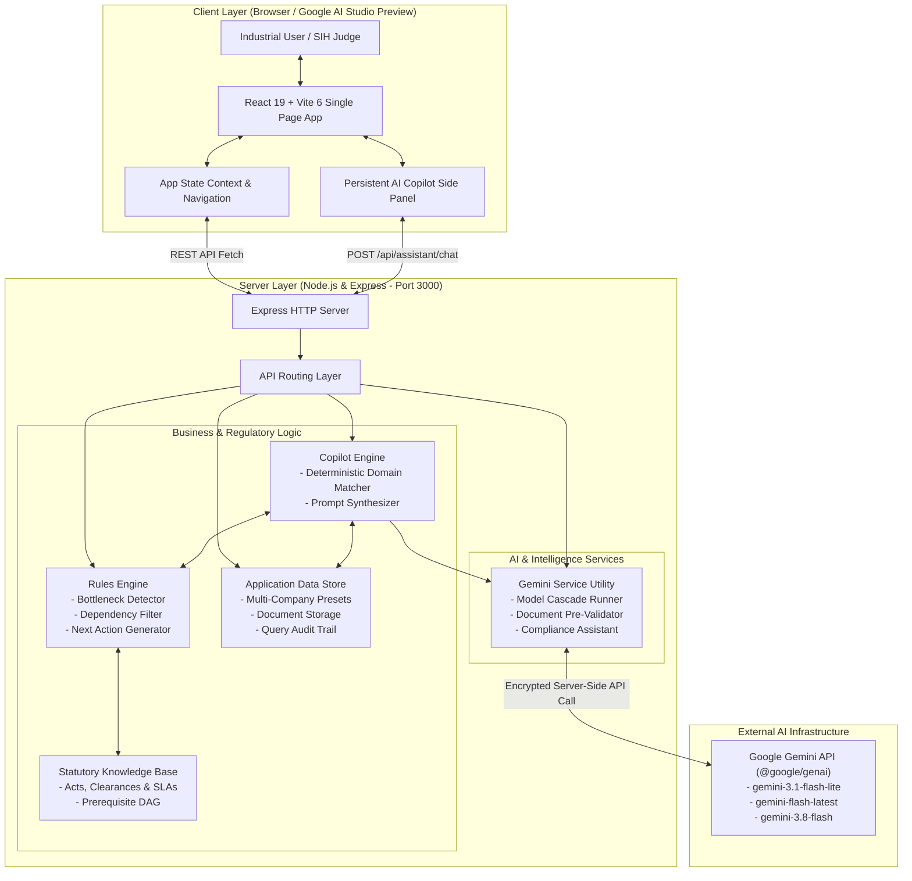

# INDUSFLOW AI

> **Intelligent Industrial Approval & Statutory Compliance Orchestration Platform**  
> *Developed for Smart India Hackathon 2026 (Problem Statement ID: SIH26130)*

[](https://indusflow-ai.ai.studio/)
[](https://react.dev/)
[](https://expressjs.com/)
[](https://tailwindcss.com/)
[](https://ai.google.dev/)
[](LICENSE)

---

## 🏆 SIH 2026

* **Hackathon:** Smart India Hackathon 2026
* **Problem Statement ID:** **SIH26130**
* **Problem Statement Title:** *Efficiency in streamlining industrial approvals, compliance processes, and access to government support services*
* **Domain:** Ease of Doing Business / Industrial Promotion & Regulatory Technology (RegTech)
* **Target Stakeholders:** Industrial entrepreneurs, MSME plant owners, factory compliance managers, single-window nodal agencies (NSWS, MAITRI, Guidance Tamil Nadu, etc.), and industrial development corporations (SIDC / MIDC).

### The Real-World Challenge
Establishing an industrial manufacturing plant in India typically mandates obtaining **20 to 45+ distinct statutory clearances, NOCs, licenses, and permits** across multi-tier authorities (Central ministries, State Pollution Control Boards, DISCOMs, Fire Directorates, Factory Inspectorates, Ground Water Authorities, and Municipal Corporations). 

Founders and plant managers face critical bottlenecks:
1. **Opaque Dependency Deadlocks:** Approvals have strict sequential dependencies (e.g., Factory Building Plan approval requires Consent to Establish [CTE] and Provisional Fire NOC; CTE requires Land Possession). Submitting out of order causes automatic rejection and wasted fee deposits.
2. **Defective Dossiers & Query Cycles:** Over 60% of application rejections and multi-month delays stem from clerical and technical discrepancies between documents (e.g., DPR stating 35 KLD water demand while ETP drawing specifies 22 KLD capacity; mismatched survey plot numbers).
3. **SLA Breaches Without Proactive Alerts:** Statutory Single Window acts enforce deemed approval SLAs (typically 30–60 days), yet enterprises lack predictive visibility into approaching deadlines or stagnant officer desks.
4. **Disjointed Incentive Discovery:** State and central industrial policy benefits (MSME capital subsidies, electricity duty exemptions, PLI incentives, green energy rebates) remain unclaimed due to complex eligibility rules.

---

## 🚀 Live Demo & Repository

* **Live Working Prototype:** [https://indusflow-ai.ai.studio/](https://indusflow-ai.ai.studio/) *(Google AI Studio Cloud Prototype)*
* **Official GitHub Repository:** [https://github.com/challamukeshreddy/INDUSFLOW-AI](https://github.com/challamukeshreddy/INDUSFLOW-AI)

---

## 🎯 Project Overview

**INDUSFLOW AI** is a purpose-built business-side orchestration platform that acts as an **intelligent navigation system for industrial establishment and operations**. It unifies regulatory intelligence, rules-driven dependency mapping, and multimodal AI document auditing into a single command dashboard.

### Core Value Propositions
* **End-to-End Clearance Roadmap:** Automatically tailors the statutory approval sequence according to manufacturing sector, CPCB pollution category (Red, Orange, Green, White), project scale, land type, connected electrical load, and boiler capacities.
* **Pre-Validation Document Hub:** Evaluates statutory application dossiers (technical drawings, water balances, stability certificates, IBR manufacturing records) against the registered business profile before single-window submission, spotting discrepancies that cause departmental queries.
* **Statutory Application & Query Tracker:** Monitors clearance milestones, tracks statutory SLA countdowns, and provides an integrated clarification workbench for addressing departmental notices.
* **Bottleneck Radar & Risk Prediction:** Proactively identifies critical-path blockers, missing prerequisite technical drawings, and approaching SLA deadlines.
* **Grounded AI Copilot:** Provides four-part structured decision support (**ANSWER**, **WHY**, **NEXT ACTION**, **SOURCE/NOTE**) powered by domain rules and Google Gemini models with multi-model cascade resilience.
* **Government Support Services & Subsidy Navigator:** Analyzes the business parameters to automatically recommend eligible central and state manufacturing incentive schemes.

---

## ✨ Key Features

### 1. Multi-Enterprise Industrial Profiles & Presets
* Rapidly switch between four realistic industrial enterprise profiles to demo diverse regulatory pathways:
  * **ABC Foods Manufacturing:** Greenfield food processing facility in Chakan MIDC, Pune (Orange category, ₹10 Cr investment, 2 TPH steam boiler, 200 kVA load).
  * **Sunrise Agro Products:** Agro-processing and dehydration plant in Nashik, Maharashtra (Green category, ₹3.5 Cr investment, small-scale MSME).
  * **Vortexa Chemicals:** Bulk organic specialty polymer and fine chemical plant in Dahej PCPIR, Gujarat (Red category, ₹45 Cr investment, hazardous storage, ZLD effluent plant).
  * **Apex BioPharma & Fine Chemicals:** Active Pharmaceutical Ingredients (API) formulation facility in Palghar, Maharashtra (Red category, ₹38.5 Cr investment).
* Live profile editor allowing dynamic tuning of land area, workforce, power, water, effluent volume, and boiler specifications.

### 2. Comprehensive Compliance & Approval Roadmap
* Displays the complete statutory clearance pathway categorized across 7 standardized establishment stages:
  * `Pre-Establishment`: Land Allotment (SIDC/MIDC), Corporate Registration, NSWS Common Application Form.
  * `Environmental & Siting`: SPCB Consent to Establish (CTE / Water & Air Act), Forest/Eco-sensitive zone buffer clearances.
  * `Building & Infrastructure`: DISCOM HT Power Sanction, Ground Water Abstraction (CGWA/State), Provisional Fire Safety NOC.
  * `Pre-Construction`: Factory Building Plan Approval (DISH / Section 6 Factories Act 1948).
  * `Pre-Operation`: SPCB Consent to Operate (CTO), Form 4 Factory License, Final Fire NOC, IBR Boiler Inspection & Registration.
  * `Operational Compliance`: Annual Environmental Audits, Hazardous Waste Return (Form 4), Monthly ECR / EPF challans.
* Shows statutory issuing authorities, legal basis acts, risk levels, fee schedules, and SLA days.

### 3. Interactive Approval Dependency Graph
* Computes mathematical topological order of clearances to prevent out-of-order statutory filings.
* Highlights the **Critical Path** in high-contrast amber/teal nodes.
* Visualizes upstream prerequisites and downstream blocked permissions.

### 4. AI Pre-Validation Document Hub
* Pre-submission audit engine designed to catch fatal submission mistakes before filing.
* Evaluates documents for:
  * Company identity matching (CIN, PAN, GSTIN, Company Name).
  * Location consistency (industrial estate, survey number, plot code).
  * Hydraulic & Mass Balance consistency (fresh water intake vs. effluent treatment capacity vs. sanitary discharge).
  * CPCB category emission limits and boiler stack height compliance.
* Assigns a 0–100 Readiness Score with color-coded status badges (`passed`, `mismatch`, `warning`, `unvalidated`).

### 5. Application Tracker & Query Notice Resolver
* Tracks application filing dates, statutory SLAs, and department review stages.
* Built-in **Department Query Notice Resolver**: Simulates official departmental clarification letters (e.g., MPCB Water Balance Notice) and allows drafting, attaching revised technical files, and logging compliance replies.

### 6. Bottleneck Radar & Next Best Action (NBA) Engine
* Rules-driven diagnostic engine categorizing risks into `CRITICAL`, `WARNING`, and `INFO`.
* Generates clear, prioritized **Next Best Actions** (Immediate, Next in Line, Routine) with direct jump-links to the exact screen and file required.

### 7. Grounded AI Regulatory Copilot
* Compact, accessible floating launcher button (`Ask AI Copilot`) present across the entire application.
* Global slide-over Copilot panel that parses the live dossier context (approvals, queries, documents, alerts).
* Delivers answers in a strict, scannable 4-part structure:
  * **ANSWER:** 1–3 sentence direct answer.
  * **WHY:** Procedural and statutory justification.
  * **NEXT ACTION:** One immediate, unambiguous task.
  * **SOURCE / NOTE:** Notice ID, Act section, or SLA guideline with safety disclaimer.
* Features quick-action pill buttons and actionable CTA shortcuts that navigate directly to the relevant view.

### 8. Government Support Schemes & Incentive Navigator
* Cross-references enterprise parameters with central and state manufacturing subsidy schemes:
  * MSME Capital Investment Subsidy (15% capital subsidy).
  * State Industrial Policy Electricity Duty Exemption (7–10 years).
  * Industrial Promotion Subsidy (SGST Refund up to 75%).
  * Green Technology & Solar Rooftop Incentive (25% rebate).
  * Interest Subvention on Working Capital & Term Loans.

### 9. Interactive Hackathon Demo Walkthrough
* Built-in guided walkthrough guide for judges and evaluators.
* Features curated 1-click test scenarios (e.g., "Demonstrate Department Query Resolution", "Inspect Critical Path Dependencies", "Run AI Document Pre-Validation", "Query Copilot on Water Balance Mismatch").

---

## 🏗️ System Architecture



---

## 🧠 AI & Intelligent Decision Flow

INDUSFLOW AI implements a **resilient hybrid AI architecture**:

1. **Deterministic Domain Engine (First Line of Defense):**
   * Before sending queries across the network, the engine evaluates domain patterns against the live dossier state (e.g., queries about "What should I do next?", "Water balance", "Boiler clearance", "Readiness score").
   * Guarantees zero latency and 100% accurate statutory facts derived from the active business profile.

2. **Google Gemini LLM Cascade with Automatic Resilience:**
   * Open-ended, conversational, or complex technical inquiries are routed server-side to the Google GenAI SDK (`@google/genai`).
   * Implements a 3-model fallback cascade:
     $$\text{gemini-3.1-flash-lite} \longrightarrow \text{gemini-flash-latest} \longrightarrow \text{gemini-3.8-flash}$$
   * Transient network errors or rate limit codes (429, RESOURCE_EXHAUSTED, 503) trigger automated exponential backoff and transparent fallback to the next model tier or structured domain response.
   * **Security Guarantee:** All Gemini API keys (`process.env.GEMINI_API_KEY`) remain strictly on the backend server and are never exposed to browser bundles or client code.

---

## 💻 Technology Stack

| Layer | Technology | Version | Purpose in INDUSFLOW AI |
| :--- | :--- | :--- | :--- |
| **Frontend Framework** | React | 19.0.1 | Modern component UI with concurrent rendering |
| **Build Tool & Bundler** | Vite | 6.2.3 | Instant hot-reloading dev server & optimized production build |
| **Language** | TypeScript | ~5.8.2 | Strict type safety across full frontend and backend data models |
| **Styling & Design** | Tailwind CSS | 4.1.14 | Clean typography, responsive grid, high-contrast accessible theme |
| **Animations** | Motion | 12.23.24 | Smooth transitions for drawers, side panels, and modal dialogs |
| **Icons** | Lucide React | 0.546.0 | Clear, modern iconography for regulatory and industrial UI |
| **Backend Runtime** | Node.js | v22+ | Server-side execution environment |
| **Backend Framework** | Express | 4.21.2 | High-performance REST API routing and static asset serving |
| **TypeScript Runner** | tsx | 4.21.0 | Native TypeScript execution in development |
| **Bundler (Backend)** | esbuild | 0.25.0 | Compiles backend `server.ts` into a standalone CommonJS bundle |
| **AI SDK** | `@google/genai` | 2.4.0 | Official Google GenAI SDK for Gemini 3 series LLMs |

---

## 🔌 Backend API Reference

| Method | Endpoint | Description |
| :--- | :--- | :--- |
| `GET` | `/api/health` | Returns backend service health, problem statement ID (`SIH26130`), and Gemini key status |
| `GET` | `/api/companies` | Lists all 4 pre-configured industrial enterprise presets |
| `POST` | `/api/profile/switch` | Switches the active enterprise profile and resets live approvals/documents |
| `GET` | `/api/profile` | Fetches the currently selected business profile |
| `PUT` | `/api/profile` | Updates business profile parameters (scale, power, water, boiler, etc.) |
| `GET` | `/api/approvals` | Retrieves the full statutory clearance catalog and status records |
| `POST` | `/api/approvals/generate-plan` | Evaluates business profile to generate customized critical-path approval plan |
| `PATCH`| `/api/approvals/:code` | Updates status, timeline days, or query details for a specific approval |
| `GET` | `/api/dependencies` | Returns graph nodes and directed dependency edges for visual mapping |
| `GET` | `/api/documents` | Lists all uploaded compliance dossiers, technical plans, and certificates |
| `POST` | `/api/documents/upload` | Validates format/size and stores a new compliance document |
| `PATCH`| `/api/documents/:id` | Modifies document metadata or validation status |
| `POST` | `/api/documents/validate/:id` | Executes AI pre-validation on a specific document using Gemini |
| `POST` | `/api/documents/validate-all` | Batch pre-validates all unverified documents in the current dossier |
| `GET` | `/api/risks` | Returns active bottleneck alerts detected by the rules engine |
| `GET` | `/api/next-actions` | Computes prioritized Next Best Actions grounded in current blockers |
| `GET` | `/api/assistant/history` | Retrieves stored Copilot conversation history |
| `POST` | `/api/assistant/chat` | Main Copilot chat endpoint generating structured 4-part guidance |
| `POST` | `/api/assistant/clear` | Clears Copilot conversation history |

---

## 🏢 Pre-Loaded Industrial Presets (Demo Data)

| Enterprise Name | Sector | Scale & Investment | Location | CPCB Category | Key Clearances Tracked |
| :--- | :--- | :--- | :--- | :---: | :--- |
| **ABC Foods Manufacturing** *(Default)* | Food Processing & Packaged Snacks | ₹10.0 Crore (Medium) | Chakan MIDC, Pune, MH | **Orange** | SIDC Land, SPCB CTE, Provisional Fire, Factory Plan, MSEDCL Power, Boiler Form II, FSSAI |
| **Sunrise Agro Products** | Agro Processing & Dehydration | ₹3.5 Crore (Small) | Dindori, Nashik, MH | **Green** | SIDC Allotment, Green CTE Exemption, MSEDCL Power, Factory Plan Approval |
| **Vortexa Chemicals** | Specialty Organic Polymers | ₹45.0 Crore (Large) | Dahej PCPIR, Gujarat | **Red** | MoEF&CC Environmental Clearance, GPCB Red CTE, PESO Petroleum License, Factory Plan, DISCOM 11kV |
| **Apex BioPharma & Fine Chemicals** | Active Pharmaceutical Ingredients | ₹38.5 Crore (Large) | Tarapur MIDC, Palghar, MH | **Red** | MPCB Red CTE, ZLD Effluent Treatment, Provisional Fire NOC, DISH Factory Plan, Boiler Registration |

---

## 🛠️ Local Setup & Execution

### Prerequisites
* **Node.js**: v18.0.0 or higher (Node.js v20/v22 recommended)
* **npm**: v9+ or **bun** / **yarn**
* **Google Gemini API Key** *(Optional for basic deterministic demo, required for live LLM queries)*: Get one at [Google AI Studio](https://aistudio.google.com/)

### 1. Clone the Repository
```bash
git clone https://github.com/challamukeshreddy/INDUSFLOW-AI.git
cd INDUSFLOW-AI
```

### 2. Install Dependencies
```bash
npm install
```

### 3. Configure Environment Variables
Copy the example environment configuration:
```bash
cp .env.example .env
```
Edit `.env` to include your Gemini API Key:
```env
GEMINI_API_KEY=your_actual_gemini_api_key_here
PORT=3000
```
*(Note: In Google AI Studio, the key is automatically injected securely into `process.env.GEMINI_API_KEY` via Settings > Secrets).*

### 4. Run the Development Server
```bash
npm run dev
```
The server starts at `http://localhost:3000`. Vite handles dynamic compilation and hot-reloading.

### 5. Production Build & Test
```bash
npm run build
npm start
```
* `npm run build` runs `vite build` to compile client assets into `dist/`, then executes `esbuild` to bundle `server.ts` into `dist/server.cjs`.
* `npm start` launches the bundled server directly via Node.js on port 3000.

---

## 🛡️ Prototype Disclaimer & Safety Guardrails

> **Statutory Notice:**  
> INDUSFLOW AI is a demonstration prototype created for Smart India Hackathon 2026 (Problem Statement SIH26130).  
> All simulated approval records, departmental queries, inspection timelines, and fee calculations are modeled after real regulatory frameworks (such as the Maharashtra Industrial Development Act, Water & Air Acts, Factories Act 1948, and Central Electricity Supply Code) for educational and prototype demonstration purposes. They do not represent official government issuance or legally binding clearance grants. Official applications must be submitted directly through authorized Single Window portals (e.g., National Single Window System - NSWS, State SWCs).

---

## 🔮 Future Roadmap & Scalability

1. **National Single Window System (NSWS) API Gateway:** Secure OAuth2 webhook integration to fetch live application status feeds and auto-sync state tracking IDs.
2. **Automated OCR & CAD Dossier Inspection:** Native PDF/DWG parsing to check factory setback boundaries, machine gangway dimensions (minimum 1.2m), and ventilation ratios directly against National Building Code (NBC) 2016.
3. **State Single Window Adapters:** Pre-mapped connectors for state platforms including MAITRI (Maharashtra), Investor Facilitation Portal (Gujarat), Single Window Karnataka, and Nivesh Mitra (Uttar Pradesh).
4. **DigiLocker Integration:** Direct statutory retrieval of verified corporate identity records, PAN, Udyam registration, and land registry 7/12 extracts.

---

## 👥 Authors & Acknowledgments

* **Team Lead & Developer:** Mukesh Reddy Challa ([@challamukeshreddy](https://github.com/challamukeshreddy))
* **Organization:** Smart India Hackathon 2026 (SIH 2026)
* **Problem Statement:** SIH26130 — *Efficiency in streamlining industrial approvals, compliance processes, and access to government support services*
* **Platform:** Developed and hosted on Google AI Studio
